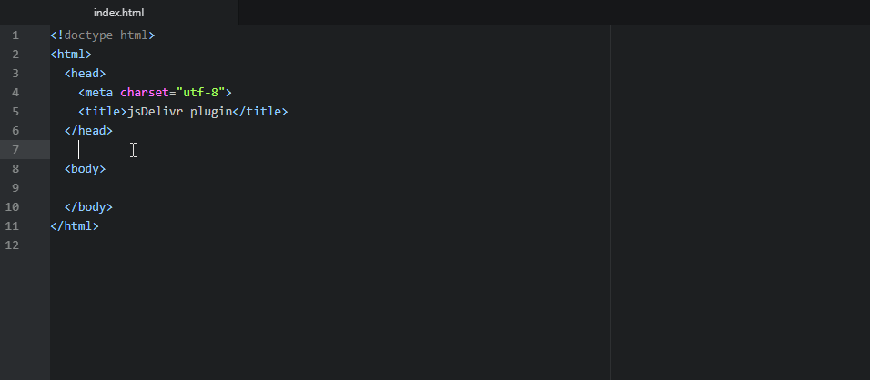

# plugin-atom

Quickly insert any npm package from [jsDelivr CDN](https://www.jsdelivr.com).

Use a keyboard shortcut (Alt + A by default) or choose "Add jsDelivr package"
from the context menu to bring up the search window.

## Installation

In your IDE, go to `File -> Settings -> Install` and search for `jsDelivr`.

## Features

 - Insert just the URL, HTML code, or HTML + SRI.
 - Offers [minified versions](https://www.jsdelivr.com/features#minify) of all CSS/JS files.
 - Quick open (press in the search results list):
    - F1 - jsDelivr package page
    - F2 - npm package page
    - F3 - GitHub page

## Setup for development

1. Fork the repository
2. In Atom IDE open new terminal (Alt+Shift+T) and run `npm install`
3. Link the package with `apm link`
4. Edit the code, note that every change you make will be applied in your Atom window after you reload it (Ctrl+Shift+F5)
